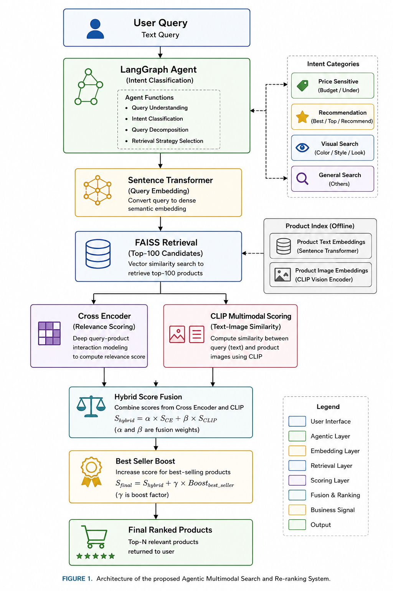
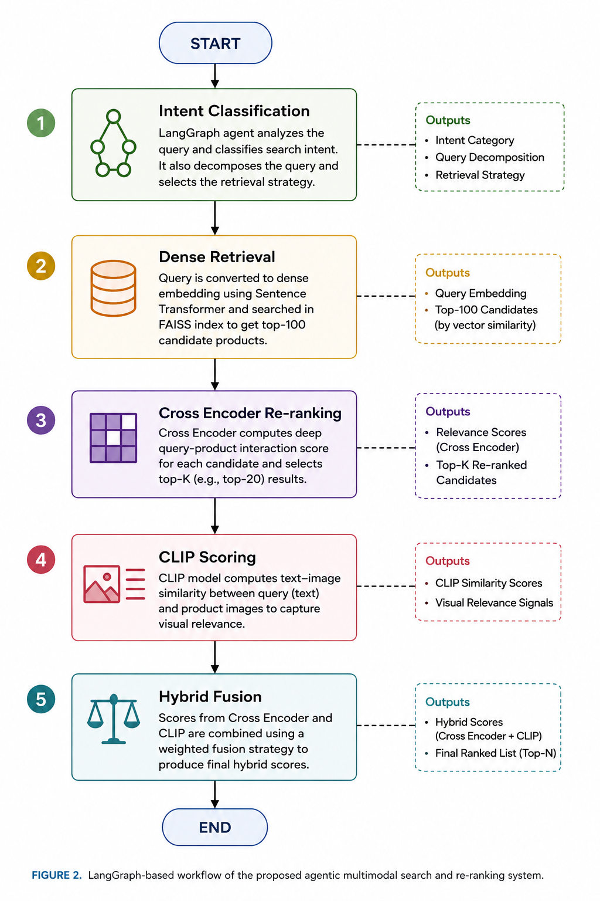
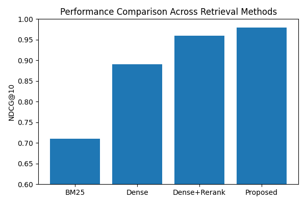

# 🚀 AGENTIC MULTIMODAL SEARCH AND RERANKING SYSTEM

An intelligent, end-to-end search system for e-commerce that combines **agentic reasoning**, **semantic understanding**, **neural re-ranking**, and **multimodal capabilities**.

---

📖 OVERVIEW

Modern e-commerce platforms contain millions of products, making accurate retrieval increasingly challenging. Traditional keyword-based search engines often fail to capture semantic intent and multimodal product information.

This project proposes an Agentic Multimodal Search and Re-ranking System that dynamically orchestrates retrieval using LangGraph, semantic embeddings, neural re-ranking, and multimodal representations.

The system intelligently analyzes user intent, retrieves semantically relevant products, re-ranks them using deep relevance estimation, and incorporates visual information through CLIP embeddings.

✨ FEATURES

🤖 Agentic query understanding using LangGraph

🔍 Dense semantic retrieval with Sentence Transformers

⚡ Fast vector similarity search using FAISS

🧠 Neural re-ranking using Cross-Encoder

🖼️ Multimodal retrieval with OpenAI CLIP

📊 Comprehensive evaluation using Information Retrieval metrics

📈 Ablation studies demonstrating contribution of each module

Results and ablation study have been conducted.

## 🏗️ SYSTEM ARCHITECTURE

📂 DATASET

Amazon Products Dataset

42,675 products
15 categories
Product titles
Ratings
Reviews
Prices
Images
Best seller information

🛠️ TECH STACK

| Component         | Technology                           |
| ----------------- | ------------------------------------ |
| Programming       | Python                               |
| Agent Framework   | LangGraph                            |
| Embeddings        | all-MiniLM-L6-v2                     |
| Vector Database   | FAISS                                |
| Neural Re-ranking | cross-encoder/ms-marco-MiniLM-L-6-v2 |
| Multimodal Model  | OpenAI CLIP                          |
| Development       | Google Colab                         |

📊 EXPERIMENTAL RESULTS

| Method                                 | NDCG@10  | Recall@10 | MRR      |
| -------------------------------------- | -------- | --------- | -------- |
| BM25                                   | 0.71     | 0.76      | 0.74     |
| Dense Retrieval                        | 0.89     | 0.92      | 0.91     |
| Dense + Re-ranking                     | 0.96     | 0.97      | 0.98     |
| **Proposed Agentic Multimodal System** | **0.98** | **0.99**  | **1.00** |

The proposed framework consistently outperformed traditional lexical retrieval methods by integrating semantic understanding, neural ranking, and multimodal representations.

WORKFLOW DIAGRAM

📈 ABLATION STUDY

| Configuration     | NDCG@10  |
| ----------------- | -------- |
| Full System       | **0.98** |
| Without Agent     | 0.95     |
| Without CLIP      | 0.96     |
| Without Re-ranker | 0.89     |

These experiments demonstrate the contribution of each component toward improving retrieval effectiveness.

📚 RESEARCH PAPER

Agentic Multimodal Search and Re-ranking System for E-commerce Product Retrieval

This repository contains the implementation accompanying the research paper proposing an adaptive retrieval framework that combines agentic reasoning, semantic search, neural re-ranking, and multimodal learning for intelligent e-commerce search.

👩‍💻 AUTHOR

Lakshmi Mayuri Kavya N

📧 Email: lucky05kavya@gmail.com

💼 LinkedIn: https://www.linkedin.com/in/lakshmi-mayuri-kavya-813157227/
